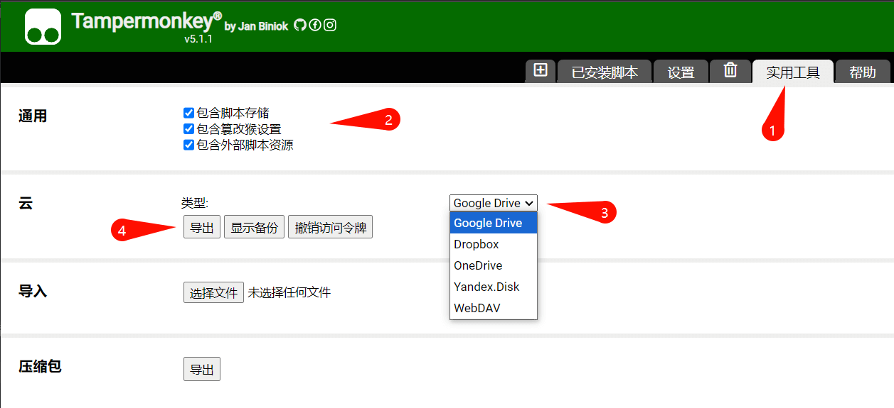
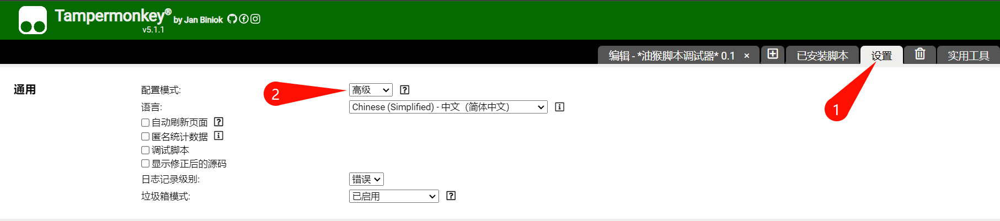
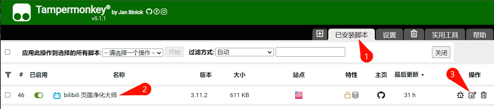
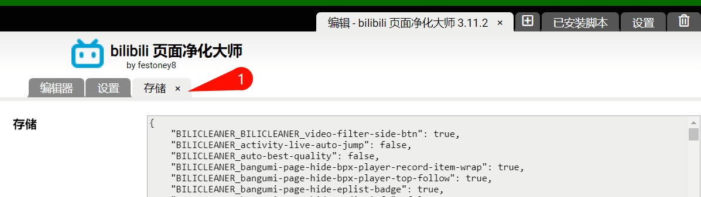

<image src="./images/logo.png" height="100"></image>
<h1>bilibili 页面净化大师</h1>

 
 

[安装使用](#安装) / [功能介绍](#功能介绍) / [浏览器适配](#浏览器适配) / [净化效果](#净化效果对比) / [插件兼容](#与其他-bilibili-插件的兼容性) / [数据备份](#数据导入与导出)
 
 

## 功能：页面净化优化、视频过滤、评论过滤、动态过滤

- **页面净化优化**：净化顶栏、视频列表、播放器、评论区等，去除无用元素，优化部分功能

- **视频过滤**：根据时长、UP 主、标题关键词、BV 号等筛选视频推荐

- **评论过滤**：根据用户名、关键词、评论类型、用户等级筛选评论

- **动态过滤**：根据用户名、视频标题等筛选动态

## 安装

### 前提：启用开发者模式

> 由于 Google 推行 Manifest V3，现在 Tampermonkey 需在开发者模式使用

- Chrome 打开网址 `chrome://extensions/`，在右上角启用 "开发者模式"
- Edge 打开网址 `edge://extensions/`，在左侧启用 "开发人员模式"
- Firefox 无需操作

### 稳定版：[前往 Greasyfork 安装](https://greasyfork.org/zh-CN/scripts/479861)

- 请查看 [**浏览器适配**](#浏览器适配)
- Chromium 系浏览器，建议在浏览器扩展管理页启用开发者模式
- 稳定版持续在 Greasyfork 发布，油猴插件会定期检查，自动更新

### 测试版：[Release 安装](https://github.com/festoney8/bilibili-cleaner/releases/)

- 开发版：[CI Build](https://github.com/festoney8/bilibili-cleaner/actions/workflows/dev-ci.yml?query=is%3Asuccess)

## 使用

> [!CAUTION]
>
> - **如果启用了大量功能、或屏蔽了大量内容，请定期备份**
> - **更换电脑或浏览器务必备份，[备份方法](#数据导入与导出)**

> [!IMPORTANT]
>
> - **重要：下列页面均有独立菜单，不同页面菜单不同，请在相应页面打开菜单进行设置**
> - **页面净化优化：**「首页、播放页、番剧播放页、直播间、搜索页、动态页、热门页、分区页」
> - **视频过滤：**「首页、播放页、搜索页、热门页、分区页、空间页」
> - **评论过滤：**「播放页、番剧播放页、动态页、空间页」
> - **动态过滤：**「动态页」
> - **快捷按钮：** 显示在页面侧栏的快捷组件，需手动启用

## 功能介绍

### 1. 页面净化

- 净化新版 bilibili 网页，默认用户已登录，大会员体验最佳
- 混搭各种功能，调节浏览器缩放比例，可得到满意的页面效果
- 不做老版本页面适配，不做未登录状态适配
- **已知问题：**
    - 给 UP 主充电时，若出现 **充电窗口载入失败 (报错NaN)**，请关闭通用项「URL参数净化」，刷新页面再充电
    - 特殊活动直播，调节脚本设置后需刷新页面才生效，弹幕净化不生效

### 2. 视频过滤

- **每个页面有独立的功能开关，但黑名单、白名单全站共用一份**
- **白名单权限高于黑名单，命中白名单的视频不会被隐藏**
- 启用 UP 主过滤后，右键单击 UP 主即可屏蔽
- 启用 BV 号过滤后，右键单击视频标题即可屏蔽
- 「标题关键词过滤」和「标题关键词白名单」大小写不敏感，均支持正则
- 正则用 `/ ... /` 括起来，如：`/abc|\d+/`，无需flag（默认`ius`模式，大小写不敏感，支持跨行）
- 视频过滤在带 `index.html` 后缀的首页不生效，请使用无后缀首页 https://www.bilibili.com/

> [!NOTE]
>
> - **时长过滤不宜过长，推荐 60~90 秒**，否则会错过优质视频
> - **关键词不宜过于简单**，可能造成误伤，屏蔽过多视频影响浏览体验
> - **编写正则要慎重**，可能造成大量视频屏蔽和频繁载入
> - **编写白名单注意影响范围**，白名单权限高，可能会让不喜欢的视频出现
> - **屏蔽后，如果视频没有消失，很可能命中了白名单**
> - 你不喜欢的低创 UP 主可能在「热门视频、每周必看、排行榜」出没，记得去热门页屏蔽一波
> - 遇到喜欢的高质量 UP 主，可以顺手加入白名单
> - 这里有一些常见标题关键词整理：[查看](./NOTE.md)

### 3. 评论过滤

- 启用用户名过滤后，在评论区右键单击用户名即可屏蔽
- 关键词黑名单大小写不敏感。正则语法：`/abc|\d+/`，无需flag（默认`ius`模式，大小写不敏感，支持跨行）
- **白名单权限高于黑名单，命中白名单的评论不会被隐藏**
- **关键词不宜过于简单**，会误伤很多评论
- **编写正则要慎重**，可能造成大量评论屏蔽和频繁载入
- **屏蔽后，如果评论没有消失，很可能命中了白名单**

## 浏览器适配

### Chrome / Edge 等 Chromium 内核浏览器

- **要求 Chromium 内核版本 >= 105**，内核版本过低会导致大量功能失效，如：无法净化顶栏

### Firefox

- **Firefox 103~120，按如下步骤开启高级设定**
    - 打开网址 [about:config](about:config)，若出现风险提示，点击「接受风险并继续」
    - 搜索 `layout.css.has-selector.enabled` ，将这一项的开关改为 `true`，并刷新网页
- **Firefox >= 121，无需修改设定**

### Safari

- 要求 Safari 版本 >= 15.4
- 未测试功能可用性

### 移动端

- 本插件专注 PC 端网页，不做移动端网页适配
- 若强行使用，建议 Firefox手机版 + 篡改猴扩展

### 脚本管理器

- **[Tampermonkey](https://www.tampermonkey.net/)（篡改猴）：已测试，推荐**

- **[Violentmonkey](https://violentmonkey.github.io/)（暴力猴）：已测试，推荐**

- **[ScriptCat](https://docs.scriptcat.org/)（脚本猫）：支持，部分测试**

- [Greasemonkey](https://www.greasespot.net/) 未测试，不推荐

## 净化效果对比

<b>查看 视频过滤 对比图（webp动图）</b>

<b>查看 播放页 对比图（webp动图）</b>

<b>查看 首页 对比图（webp动图）</b>

<b>查看 动态页 对比图（webp动图）</b>

<b>查看 直播页 对比图</b>

### before

### after

<b>查看 热门视频/排行榜页 对比图</b>

### before

### after

## 与其他 bilibili 插件的兼容性

<b>展开查看</b>

### 1. 与 [Bilibili-Evolved](https://github.com/the1812/Bilibili-Evolved) 的兼容性

- 绝大多数功能兼容，小部分功能重复，均不会产生崩坏

- **隐藏首页banner**

    - 使用「Evolved 夜间模式」时，开启 Evolved 的「隐藏顶部横幅」，关闭本脚本的「隐藏 banner」
    - 使用「Evolved 顶栏」时，开启 Evolved 的「隐藏顶部横幅」，关闭本脚本的「隐藏 banner」
    - 不使用「Evolved 顶栏」时，关闭 Evolved 的「隐藏顶部横幅」，开启本脚本的「隐藏 banner」

- **清爽首页、极简首页** 会接管首页布局，本脚本对其无效

### 2. 与 [Bilibili-Gate](https://github.com/magicdawn/bilibili-gate) 的兼容性

- **兼容**，Bilibili-Gate 自带 UP 主黑名单、标题关键词过滤，在首页无需使用本插件的过滤功能

### 3. 与 [Bilibili 旧播放页](https://github.com/MotooriKashin/Bilibili-Old) 的兼容性

- **不兼容**，旧播放页脚本完全接管页面，使用该脚本时请在脚本管理器中关闭本净化脚本，以免造成干扰

### 4. 与 [Pakku.js](https://github.com/xmcp/pakku.js) 的兼容性

- **兼容**，推荐搭配使用

### 5. 与 [BewlyBewly](https://github.com/hakadao/BewlyBewly) 的兼容性

- 不兼容 BewlyBewly 新版首页
- 兼容 BewlyBewly 使用原版 B 站首页

## 数据导入与导出

- 更换电脑或浏览器时，需全选油猴插件内所有脚本，一并导出数据，在另一设备恢复
- TamperMonkey 和 ViolentMonkey 插件的同步脚本功能只能同步代码，但不同步数据，同步数据请使用导入导出或云端备份功能

<b>导出数据</b>

<b>导入数据</b>

<b>备份数据到云端</b>

 

- 这一操作将备份 TamperMonkey 内所有脚本代码及其本地数据到云端
- 点击 **显示备份** 按钮查看历史备份
- ViolentMonkey 插件无这一功能，只支持备份到本地

<b>复制 JSON 数据</b>

 

- 可通过开启插件管理器的高级模式，复制脚本 JSON 数据，可用于保存或快速在另一设备导入
- 请勿在未知后果的情况下编辑 JSON 数据

## 鸣谢

- [vite-plugin-monkey](https://github.com/lisonge/vite-plugin-monkey)
- [vue.js](https://vuejs.org/)
- [vueuse](https://github.com/vueuse/vueuse)
- [pinia](https://github.com/vuejs/pinia)
- [tailwindcss](https://github.com/tailwindlabs/tailwindcss)
- [headlessui](https://github.com/tailwindlabs/headlessui)

## 开发

- 分支介绍

    - main 分支只用于发布测试版和稳定版
    - dev 分支用于开发，可 PR 到本分支
    - release 分支由 CI 管理，存储产物，作为 Github/JsDelivr 源文件

- 环境要求

    - node.js >= 22
    - pnpm >= 9.0
    - 使用新版 Chrome / Edge / Firefox，安装 tampermonkey 或 violentmonkey

- 编译运行

    1. clone 项目，`pnpm i` 安装依赖
    2. 使用 `pnpm dev` 进入 dev 模式，会自动打开浏览器安装开发用脚本（由 vite-plugin-monkey 控制）
        - dev 模式下，修改 vue/scss 代码并保存时可实时生效，修改 typescript 会触发页面自动刷新
    3. 使用 `pnpm build` 构建，产物在 `dist` 文件夹内
