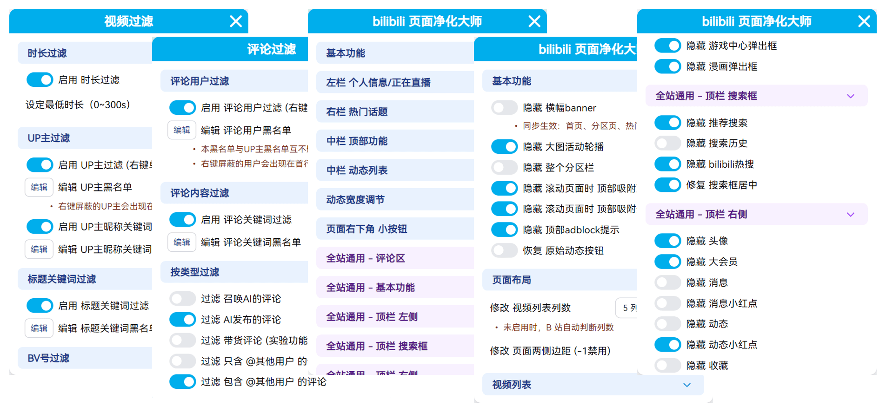
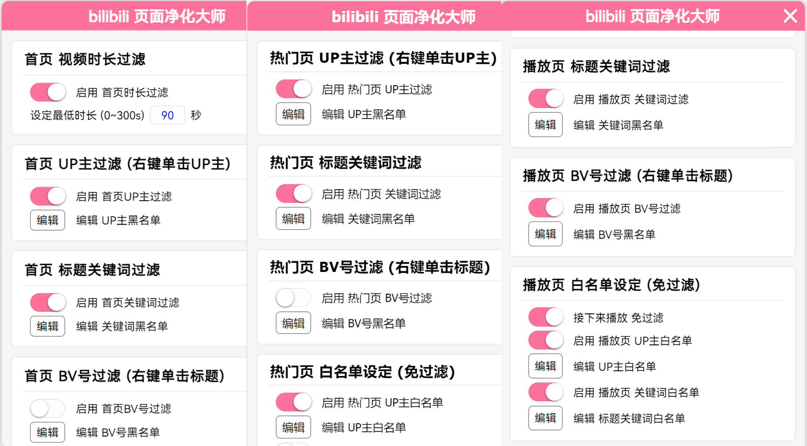
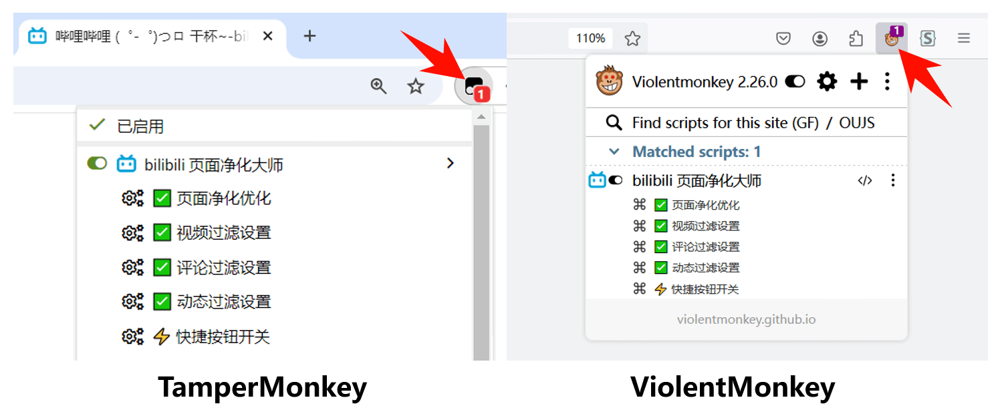
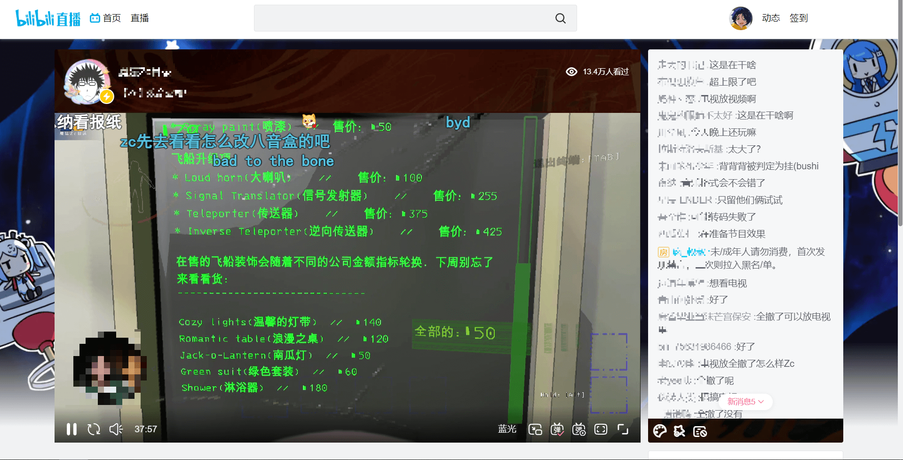
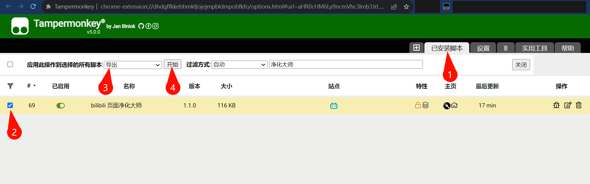
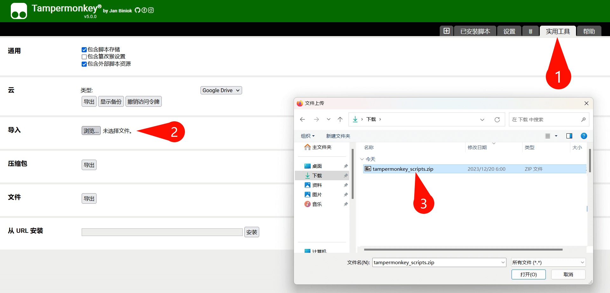
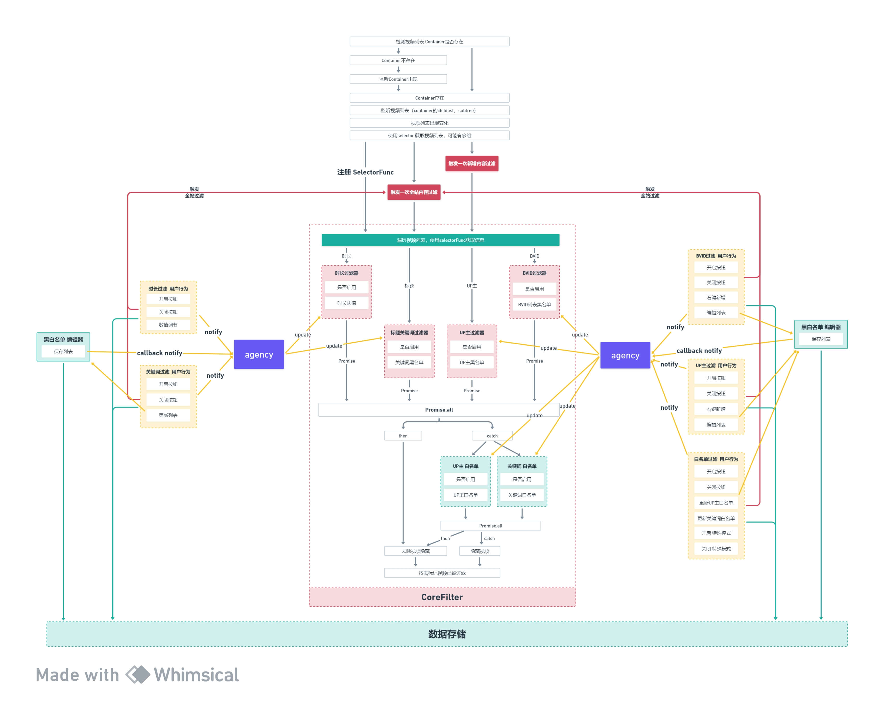

<image src="./images/logo.png" height="120"></image>
<h1>bilibili 页面净化大师</h1>

<b>高度定制化的 bilibili 网页净化插件，提供 300+ 个功能开关，深度净化页面元素</b>

 

支持去广告、BV号转AV号、播放器净化、过滤视频 等多种细节功能

 

[安装使用](#%E5%AE%89%E8%A3%85) / [功能介绍](#%E5%8A%9F%E8%83%BD%E4%BB%8B%E7%BB%8D) / [浏览器适配](#%E6%B5%8F%E8%A7%88%E5%99%A8%E9%80%82%E9%85%8D) / [净化效果](#%E5%87%80%E5%8C%96%E6%95%88%E6%9E%9C%E5%AF%B9%E6%AF%94) / [插件兼容](#%E4%B8%8E%E5%85%B6%E4%BB%96-bilibili-%E6%8F%92%E4%BB%B6%E7%9A%84%E5%85%BC%E5%AE%B9%E6%80%A7) / [数据导出](#%E6%95%B0%E6%8D%AE%E5%AF%BC%E5%85%A5%E4%B8%8E%E5%AF%BC%E5%87%BA)
 
 

## 功能一览

### 页面元素净化

### 过滤视频推荐（测试阶段）

## 安装

### 稳定版：[**前往 Greasyfork 安装**](https://greasyfork.org/zh-CN/scripts/479861)

-   **Firefox** 浏览器请查看 [**浏览器适配**](#%E6%B5%8F%E8%A7%88%E5%99%A8%E9%80%82%E9%85%8D)
-   稳定版持续在 Greasyfork 发布，油猴插件会定期检查，自动更新

### 测试版：[Release安装](https://github.com/festoney8/bilibili-cleaner/releases/)

-   开发版：[CI Build](https://github.com/festoney8/bilibili-cleaner/actions/workflows/dev-ci.yml?query=is%3Asuccess)

## 使用

-   **注意「首页、播放页、版权作品播放页、直播间、搜索页、动态页、热门视频页」这 7 个页面，菜单各不相同**，「通用」项目对所有页面生效

-   按下图打开菜单，在每个页面进行自定义净化，支持实时预览

## 功能介绍

### 页面净化

-   适用于 **净化新版 bilibili 网页**，不做老版本页面适配
-   目前支持「首页、播放页、版权作品播放页、直播间、搜索页、动态页、热门视频/排行榜页」这 7 个页面，可在每个页面下开启插件菜单，查看功能列表
-   默认用户已登录，大会员下(开发环境)体验最佳
-   默认开启少数基础功能，其余功能由用户自行设定
-   大多数功能实时生效。脚本在开启网页后立即注入，所有隐藏元素规则在开启页面后 1 秒内生效。其他需要等待元素出现的功能，如「净化分享」生效较慢

### 过滤视频

-   **注意：过滤功能仍处于测试阶段**
-   **如果屏蔽列表添加了大量内容，请定时备份插件数据**
-   支持「首页、播放页、热门页（热门视频/每周必看/排行榜）」共 3 个页面
-   支持「UP主、BV号、标题关键词、视频时长」共 4 种过滤模式
-   黑名单、白名单全站通用，**一次屏蔽，全站隐藏**（只要开关开启就会隐藏）
-   白名单权限高于黑名单，命中白名单的视频不会被隐藏
-   「标题关键词过滤」功能的黑/白名单大小写不敏感，二者均支持正则表达式
    > 正则语句需使用 `/ ... /` 括起来，如 `/abc|d|e/`。反斜杠使用单斜杠，如 `/\d+/`。正则为 iv 模式，大小写不敏感。
-   Tips：
    -   注意：屏蔽 UP 主时，不要反复点开他们的视频和个人页，推荐系统会误认为你喜欢，导致推送变差
    -   时长过滤不宜设定过长，会丢失掉好视频，推荐设定 60~90 秒
    -   屏蔽经常出现的 UP 主可以让「热门视频、每周必看、排行榜」变得非常舒服
    -   由于白名单的高权限，编写白名单关键词请注意影响面，会导致命中白名单的低质量视频被强制显示出来
    -   编写正则表达式请小心，可能造成大量视频被屏蔽
    -   遇到每期必看的高质量 UP 主，可以顺手把他们加入白名单
    -   屏蔽视频时会在 Console 输出日志，按 F12 查看日志

### 快捷键

-   支持使用快捷键 `Alt + B` 或 `Ctrl + Alt + B` 快速开启/关闭**页面净化**功能，迅速查看净化对比
-   Firefox 浏览器仅支持 `Ctrl + Alt + B`
-   临时使用被隐藏的按钮时，只需快捷键快速关闭插件，不用打开菜单寻找选项
-   快速关闭只支持停用CSS规则，部分功能不支持，如：BV号转AV号

### 注意事项

-   给 UP 主充电时，若出现 **充电窗口载入失败 (报错NaN)**，请关闭 **通用项「URL参数净化」** 功能，刷新页面再充电
-   **「版权视频播放页」大部分功能与「播放页」一致且互相同步，小部分独有功能已用 "★" 重点标出**
-   「动态页」评论区相关功能与「播放页」一致且互相同步
-   「直播页」顶栏与普通顶栏不同，通用功能对其不生效（仅搜索栏少数功能与通用同步）
-   「首页」默认 10 个推荐位，在显示 5 列的情况下，若同时隐藏广告和分区视频，会产生一个待载入空位（骨架），可调节骨架相关选项改善观感；在显示 6 列的情况下，会自动载入一轮推荐视频，有一段时间的载入延迟
-   「强制页面布局」功能，适用于和 浏览器缩放比率（100%/110%/125%）、增大字号、隐藏元素 等功能混搭使用，调节出满意的页面效果
-   已知 bug，Firefox 的「强制页面布局」可能出现过长文字换行问题

## 浏览器适配

### Chrome / Edge

-   **要求 Chrome 内核版本 >= 105**，浏览器内核版本过低会导致部分功能失效，如：无法净化顶栏

    > 鉴于 Google 在推行 [Manifest V3](https://developer.chrome.com/docs/extensions/migrating/checklist)，未来会影响油猴插件，参考[Tampermonkey changelog](https://www.tampermonkey.net/changelog.php#v5.0.0)。
    > 可考虑启用浏览器开发者模式，Chrome 和 Edge 均可在插件管理页找到开关。

### Firefox

-   **Firefox版本 103~120，按如下步骤开启高级设定**
    -   在浏览器内打开网址 [about:config](about:config)，若出现风险提示，点击「接受风险并继续」
    -   搜索 `layout.css.has-selector.enabled` ，将这一项的开关改为 `true`，并刷新标签页
-   **Firefox版本 > 121，无需修改设定**

### Safari

-   未测试

### 脚本管理插件

|         | [Tampermonkey](https://www.tampermonkey.net/) (油猴插件)                                                | [Violentmonkey](https://violentmonkey.github.io/) (暴力猴)                                       |
| ------- | ------------------------------------------------------------------------------------------------------- | ------------------------------------------------------------------------------------------------ |
| Chrome  | [链接](https://chrome.google.com/webstore/detail/dhdgffkkebhmkfjojejmpbldmpobfkfo)                      | [链接](https://chrome.google.com/webstore/detail/violentmonkey/jinjaccalgkegednnccohejagnlnfdag) |
| Edge    | [链接](https://microsoftedge.microsoft.com/addons/detail/tampermonkey/iikmkjmpaadaobahmlepeloendndfphd) | [链接](https://microsoftedge.microsoft.com/addons/detail/eeagobfjdenkkddmbclomhiblgggliao)       |
| Firefox | [链接](https://addons.mozilla.org/firefox/addon/tampermonkey/)                                          | [链接](https://addons.mozilla.org/firefox/addon/violentmonkey/)                                  |
| 测试    | **已测试，推荐**                                                                                        | 支持，部分测试                                                                                   |

-   Safari 浏览器的脚本管理插件未进行测试
-   [Greasemonkey](https://www.greasespot.net/) 和 [ScriptCat](https://docs.scriptcat.org/) 未进行测试

## 净化效果对比

<b>查看 播放页 对比图（webp动图）</b>

<b>查看 首页 对比图（webp动图）</b>

<b>查看 动态页 对比图（webp动图）</b>

<b>查看 直播页 对比图</b>

### before

### after

<b>查看 热门视频/排行榜页 对比图</b>

### before

### after

## 与其他 bilibili 插件的兼容性

### 与 [Bilibili-Evolved](https://github.com/the1812/Bilibili-Evolved) 的兼容性

-   绝大多数功能兼容，小部分功能重复，均不会产生崩坏

-   本脚本中的 通用项「隐藏-顶栏相关」对 Evolved 的自定义顶栏无效

-   **隐藏首页banner**

    -   使用「Evolved 夜间模式」时，开启 Evolved 的「隐藏顶部横幅」，关闭本脚本的「隐藏 banner」

    -   使用「Evolved 顶栏」时，开启 Evolved 的「隐藏顶部横幅」，关闭本脚本的「隐藏 banner」
    -   不使用「Evolved 顶栏」时，关闭 Evolved 的「隐藏顶部横幅」，开启本脚本的「隐藏 banner」

-   **清爽首页、极简首页** 会接管首页布局，本脚本对其无效

### 与 [bilibili-app-recommend](https://greasyfork.org/zh-CN/scripts/443530) 的兼容性

-   **兼容**，提供 **隐藏 视频tag / 隐藏 弹幕数 / 隐藏 点赞数** 功能，在首页功能菜单末尾

### 与 [Bilibili 旧播放页](https://github.com/MotooriKashin/Bilibili-Old) 的兼容性

-   **不兼容**，旧播放页脚本完全接管页面，使用该脚本时请在脚本管理器中关闭本净化脚本，以免造成干扰

## 数据导入与导出

### 导出数据 (以 Tampermonkey 为例)

### 导入数据

## Ref

-   [vite-plugin-monkey](https://github.com/lisonge/vite-plugin-monkey)
-   [Manifest V3](https://developer.chrome.com/docs/extensions/migrating/checklist)
-   [TamperMonkey 5.0](https://www.tampermonkey.net/changelog.php#v5.0.0)

## Contribution

-   main branch 只用于发布测试版和稳定版
-   dev branch 用于开发

视频过滤流程

